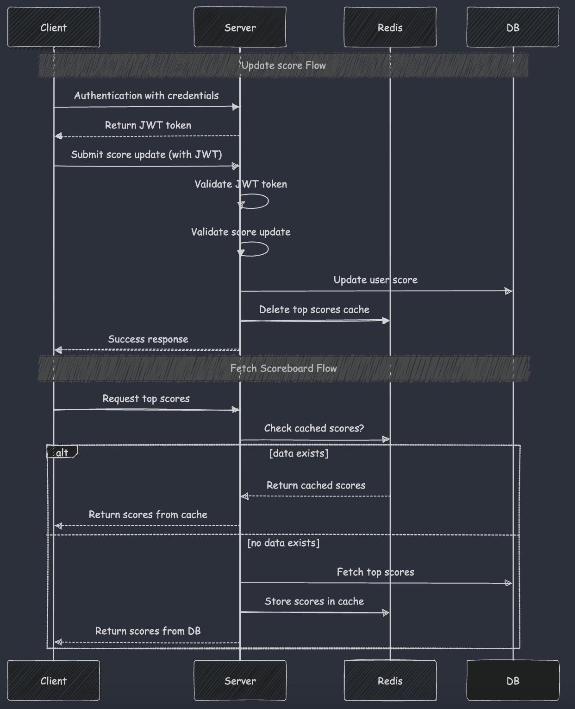
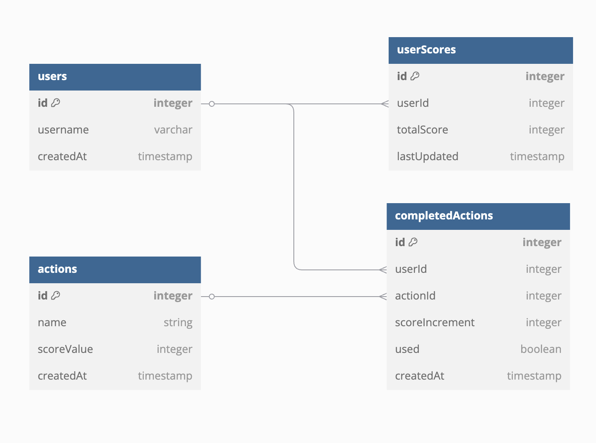

# Scoreboard Module Specification

### Software Requirements
1. We have a website with a score board, which shows the top 10 user’s scores.
2. We want live update of the score board.
3. User can do an action (which we do not need to care what the action is), completing this action will increase the user’s score.
4. Upon completion the action will dispatch an API call to the application server to update the score.
5. We want to prevent malicious users from increasing scores without authorisation.

## Sequence Flow


## Database Schema


## API Endpoints

### 1. Update Score
```
POST /api/v1/scores/update
```

#### Request Headers
- `Authorization: Bearer <JWT_TOKEN>`
- `Content-Type: application/json`

#### Request Body
```json
{
  "completedActionId": "string" // Unique id from completedActions table
}
```

#### Response
```json
{
  "success": "boolean",
  "newScore": "number"
}
```

### 2. Get Top Scores
```
GET /api/v1/scores/top
```

#### Query Parameters
- `limit`: number (default: 10)

#### Response
```json
{
  "scoreboard": [
    {
      "userId": "string",
      "username": "string",
      "score": "number",
      "rank": "number"
    }
  ]
}
```

## Technical Requirements

1. Score update requests must be authenticated using JWT tokens
2. Check completedAction is valid before updating score (used = false)
3. The scoreIncrement should be getted from completedActions table to prevent users from intentionally changing the incremented score.
4. Should implement rate limit
5. Using database locking for updating the score to prevent race conditions
6. Use Redis for caching top scores
7. Use WebSockets to push new top scores to connected clients.

## Additional Comments for Improvement

1. Add logging for score updates
2. Support multiple leaderboards (daily, weekly)
3. Horizontal scaling of API servers (Server/Database Replication)
